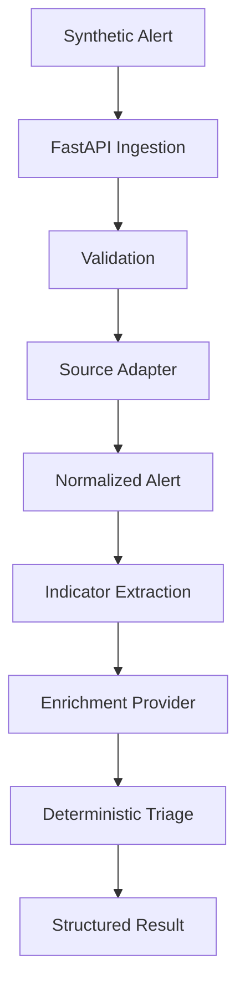

# SOC Automation Platform

[](https://github.com/example/soc-automation/actions/workflows/ci.yml)

## Problem

Security operations teams receive large numbers of endpoint alerts and need reliable enrichment and prioritization before analyst investigation.

## Current Stage

**Stage 1: Security Automation Core**

This repository processes a **CrowdStrike-style synthetic alert**. It is not an official CrowdStrike schema, proprietary telemetry, real CrowdStrike data, or a production integration.

## Solution

The vertical slice is intentionally small and deterministic:

`Ingest -> Normalize -> Extract -> Enrich -> Triage`

A suspicious synthetic PowerShell alert enters FastAPI, is validated and normalized behind a source adapter, enriched using a fixed mock table, and returned with an explainable decision.

## Architecture



See [docs/architecture.md](docs/architecture.md) for components, trust boundaries, and failure behavior.

## Security Design Principles

- Deterministic triage is authoritative and explainable.
- External-style data is untrusted and enrichment is fallible.
- Enrichment failures fail closed to `ANALYST_REVIEW`, never to `ESCALATE` or `LOW_RISK`.
- Validation occurs at API and source-adapter boundaries.
- Request bodies are bounded at 256 KiB.
- Tests enforce offline execution with `pytest-socket`.
- No secrets are committed; every example IP is from an RFC 5737 documentation range.

## Running Locally

The project uses `uv` and `pyproject.toml` as its dependency source. The authoring environment did not have `uv`, so local verification used the documented pip fallback. With `uv` installed:

```bash
uv sync --extra dev
make test
make lint
make typecheck
make run
```

Fallback without `uv`:

```bash
python -m pip install -e ".[dev]"
make test
make lint
make typecheck
make run
```

The API is available at `http://127.0.0.1:8000`, with OpenAPI docs at `/docs`.

## API Example

This sends the reusable high-risk fixture shape. All values are synthetic.

```bash
curl -X POST http://127.0.0.1:8000/api/v1/alerts \
  -H "Content-Type: application/json" \
  -d '{
    "alert_id":"synthetic-high-001",
    "timestamp":"2026-01-15T12:00:00Z",
    "hostname":"workstation-07",
    "username":"synthetic.user",
    "severity":"HIGH",
    "process_name":"powershell.exe",
    "command_line":"powershell.exe -EncodedCommand synthetic-payload",
    "source_ip":"192.0.2.25",
    "destination_ip":"198.51.100.10",
    "file_hash":"aaaaaaaaaaaaaaaaaaaaaaaaaaaaaaaaaaaaaaaaaaaaaaaaaaaaaaaaaaaaaaaa",
    "detection_description":"Synthetic encoded PowerShell command contacted a known synthetic C2 indicator.",
    "source":"crowdstrike-style-synthetic"
  }'
```

The response includes the normalized alert, indicators, enrichment, ordered processing history, and this triage block:

```json
{
  "decision": "ESCALATE",
  "rules_triggered": ["RULE_A_HIGH_RISK_MALICIOUS"],
  "reason": "High-risk severity is supported by malicious enrichment evidence.",
  "evidence": {"severity": "HIGH", "reputations": ["malicious"]}
}
```

## Testing

`make test` runs pytest with `--disable-socket` globally. The API tests use an in-process ASGI transport, so the suite does not need loopback networking. Tests cover valid, malformed, oversized, unsupported, ambiguous, low-risk, and enrichment-failure paths, plus RFC 5737 fixture checks and Rule B precedence.

## Limitations

- Synthetic security data only.
- Mock threat-intelligence provider only.
- Prototype, not production-hardened.
- No live CrowdStrike integration or automated containment.
- No authentication or authorization.
- No production deployment claim.

## Roadmap

Later stages may add bounded AI-assisted investigation, structured AI output validation, an analyst-facing investigation UI, and additional audit/evidence features. They are intentionally not implemented here.

## License

Released under the MIT License. See [LICENSE](LICENSE).
