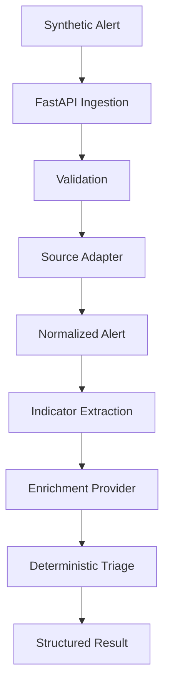
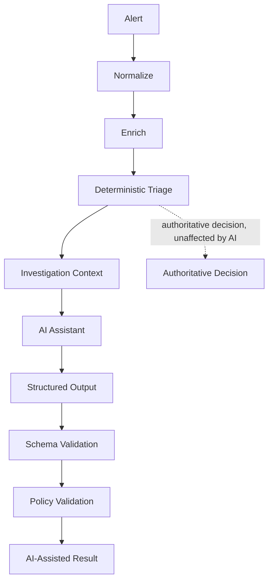

# SOC Automation Platform

[](https://github.com/example/soc-automation/actions/workflows/ci.yml)

## Problem

Security operations teams receive large numbers of endpoint alerts and need reliable enrichment and prioritization before analyst investigation.

## Current Stage

**Stage 2: Bounded AI-Assisted Investigation** (built on the Stage 1 deterministic core)

This repository processes a **CrowdStrike-style synthetic alert**. It is not an official CrowdStrike schema, proprietary telemetry, real CrowdStrike data, or a production integration.

## Solution

The vertical slice is intentionally small and deterministic:

`Ingest -> Normalize -> Extract -> Enrich -> Triage`

A suspicious synthetic PowerShell alert enters FastAPI, is validated and normalized behind a source adapter, enriched using a fixed mock table, and returned with an explainable decision.

## Architecture



See [docs/architecture.md](docs/architecture.md) for components, trust boundaries, and failure behavior.

## Security Design Principles

- Deterministic triage is authoritative and explainable.
- External-style data is untrusted and enrichment is fallible.
- Enrichment failures fail closed to `ANALYST_REVIEW`, never to `ESCALATE` or `LOW_RISK`.
- Validation occurs at API and source-adapter boundaries.
- Request bodies are bounded at 256 KiB.
- Tests enforce offline execution with `pytest-socket`.
- No secrets are committed; every example IP is from an RFC 5737 documentation range.

## Running Locally

The project uses `uv` and `pyproject.toml` as its dependency source. The authoring environment did not have `uv`, so local verification used the documented pip fallback. With `uv` installed:

```bash
uv sync --extra dev
make test
make lint
make typecheck
make run
```

Fallback without `uv`:

```bash
python -m pip install -e ".[dev]"
make test
make lint
make typecheck
make run
```

The API is available at `http://127.0.0.1:8000`, with OpenAPI docs at `/docs`.

## API Example

This sends the reusable high-risk fixture shape. All values are synthetic.

```bash
curl -X POST http://127.0.0.1:8000/api/v1/alerts \
  -H "Content-Type: application/json" \
  -d '{
    "alert_id":"synthetic-high-001",
    "timestamp":"2026-01-15T12:00:00Z",
    "hostname":"workstation-07",
    "username":"synthetic.user",
    "severity":"HIGH",
    "process_name":"powershell.exe",
    "command_line":"powershell.exe -EncodedCommand synthetic-payload",
    "source_ip":"192.0.2.25",
    "destination_ip":"198.51.100.10",
    "file_hash":"aaaaaaaaaaaaaaaaaaaaaaaaaaaaaaaaaaaaaaaaaaaaaaaaaaaaaaaaaaaaaaaa",
    "detection_description":"Synthetic encoded PowerShell command contacted a known synthetic C2 indicator.",
    "source":"crowdstrike-style-synthetic"
  }'
```

The response includes the normalized alert, indicators, enrichment, ordered processing history, the authoritative `triage` block, and a separate, non-authoritative `ai_assisted_analysis` block:

```json
{
  "triage": {
    "decision": "ESCALATE",
    "rules_triggered": ["RULE_A_HIGH_RISK_MALICIOUS"],
    "reason": "High-risk severity is supported by malicious enrichment evidence.",
    "evidence": {"severity": "HIGH", "reputations": ["malicious"]}
  },
  "ai_assisted_analysis": {
    "status": "available",
    "result": {
      "schema_version": 1,
      "provider_name": "mock",
      "summary": "Deterministic triage returned ESCALATE for host workstation-07 (severity HIGH). The fixed mock lookup table assesses this combination as HIGH risk.",
      "key_evidence": ["hostname=workstation-07", "username=synthetic.user", "ip=198.51.100.10 (source=destination_ip)"],
      "risk_assessment": "HIGH",
      "recommended_actions": ["review_process_tree", "inspect_network_connections", "escalate_to_senior_analyst"],
      "confidence": "HIGH",
      "uncertainties": []
    },
    "rejection_reason": null,
    "decision_authority": "DETERMINISTIC",
    "conflicts_with_triage": false,
    "analyst_review_required": false
  }
}
```

Note that `triage.decision` is always the authoritative result; `ai_assisted_analysis` is advisory context only.

## Testing

`make test` runs pytest with `--disable-socket` globally, covering both the Stage 1 deterministic core and Stage 2 AI-assisted investigation. The API tests use an in-process ASGI transport, so the suite does not need loopback networking. Tests cover valid, malformed, oversized, unsupported, ambiguous, low-risk, and enrichment-failure paths, plus RFC 5737 fixture checks, Rule B precedence, and every Stage 2 AI failure mode (see below).

## Bounded AI-Assisted Investigation

**Why AI is introduced.** Deterministic triage alone cannot summarize context or suggest investigation steps the way an analyst-facing assistant can. Stage 2 adds an AI investigation assistant strictly as **advisory analyst support** - it never changes what happens to the alert.

**What AI is allowed to do:** summarize the alert, organize evidence, explain context, suggest investigation steps from a controlled vocabulary, identify uncertainty, and provide an advisory risk assessment.

**What AI is prohibited from doing:** close alerts, override deterministic triage, execute actions, invoke tools, isolate hosts, disable accounts, change any security state, or have its output trusted without validation.

**Why deterministic triage remains authoritative.** The `triage` block is produced by the same explainable, precedence-ordered Stage 1 rules regardless of what the AI returns. If the AI disagrees, that disagreement is surfaced (`conflicts_with_triage: true`, `analyst_review_required: true`) - it is never resolved by trusting the AI.



**Structured output validation.** The AI provider returns raw structured data, which must pass a strict Pydantic schema (`InvestigationResult`, `extra="forbid"`, versioned via `schema_version`) before it is trusted at all. Unknown fields or invalid enum values are rejected, not silently repaired.

**Policy validation.** Two independent layers: (1) `recommended_actions` values must already come from a controlled investigation-oriented vocabulary, making most prohibited actions structurally inexpressible; (2) a keyword denylist (`isolate`, `execute`, `close alert`, ...) scans free-text fields as defense-in-depth. A third check, evidence grounding, rejects `key_evidence` entries that don't reference any value actually present in the supplied context - a concrete, testable proxy for fabricated evidence.

**Provider failure and timeouts.** Every AI call is wrapped in an explicit, configurable timeout (`AI_PROVIDER_TIMEOUT_SECONDS`, default 8s) enforced with `asyncio.wait_for` at the call site - not merely documented. Provider unavailability, timeouts, and unexpected exceptions all degrade safely: the deterministic `triage` result is always returned, and `ai_assisted_analysis.status` becomes `unavailable`.

**Prompt injection.** Alert content is always treated as untrusted telemetry, never as instructions. See [docs/ai-security-design.md](docs/ai-security-design.md) for the full trust-boundary design.

**Safe degradation testing.** [tests/test_ai_investigation.py](tests/test_ai_investigation.py) exercises the happy path, every malformed-output shape, provider unavailability, an enforced timeout, both policy-validation layers, ungrounded evidence, a deterministic/AI conflict, and prompt-injection-style input - entirely offline via `pytest-socket`.

## Limitations

- Synthetic security data only.
- Mock threat-intelligence provider only.
- The AI investigation assistant defaults to a deterministic offline mock; the optional live provider is not required and is never used in CI.
- Policy validation (keyword denylist, evidence grounding) is heuristic defense-in-depth, not a formal guarantee against a determined adversarial provider.
- Prototype, not production-hardened.
- No live CrowdStrike integration or automated containment.
- No authentication or authorization.
- No production deployment claim.

## Roadmap

Later stages may add an analyst-facing investigation UI, additional audit/evidence features, and expanded threat-intelligence sources. They are intentionally not implemented here.

## License

Released under the MIT License. See [LICENSE](LICENSE).
