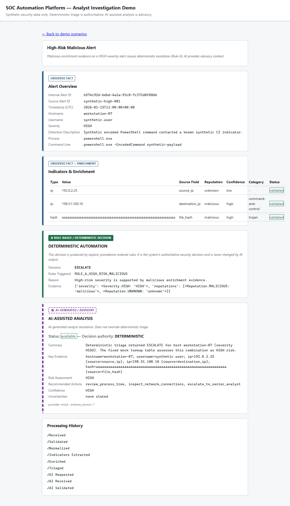
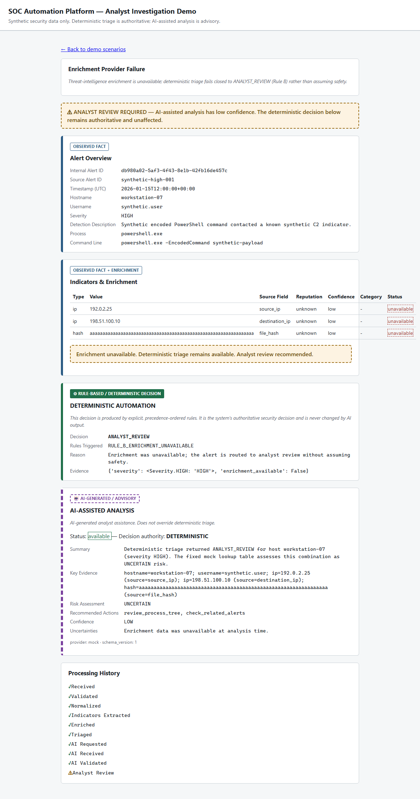
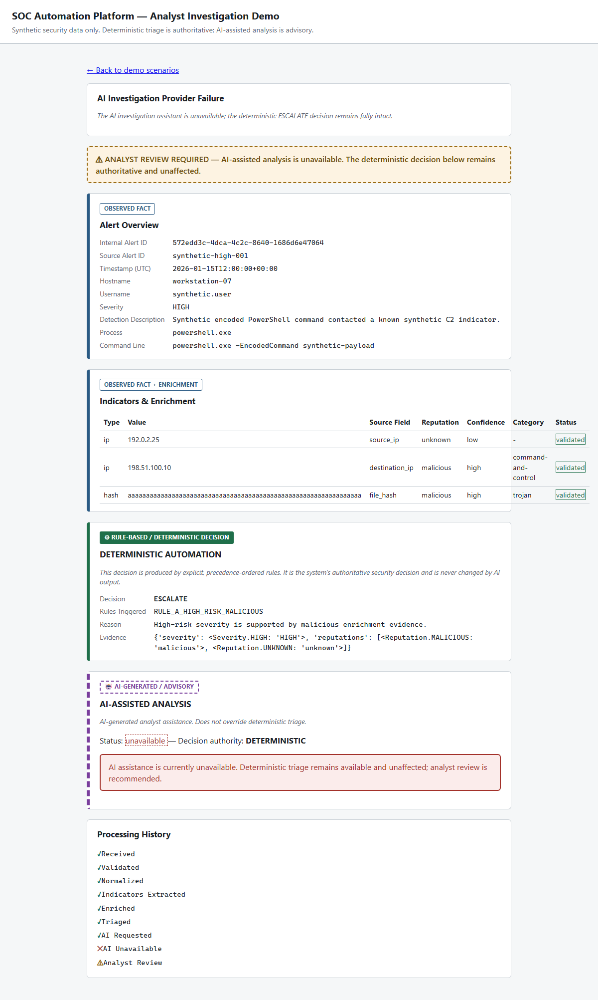

# SOC Automation Platform

An automation-first SOC workflow: ingest a synthetic security alert, enrich its indicators, apply explainable deterministic triage, and layer in bounded, validated AI-assisted investigation &mdash; with an analyst-facing demo view that makes every trust boundary visible.

[](https://github.com/TomIsTheHunter/soc-automation/actions/workflows/ci.yml)

> The GitHub Actions workflow runs on the `master` branch; a live run (`quality`, `secret-scan`, `docker-build`) has been confirmed green ([run 32435854241](https://github.com/TomIsTheHunter/soc-automation/actions/runs/32435854241)).

## Why This Exists

SOC analysts are flooded with endpoint alerts. Most of the triage work is repetitive: pull the indicators, check if they're known-bad, decide whether this is worth a human's time. Doing that by hand at volume is slow and inconsistent; doing it with an opaque black box is dangerous. This project demonstrates a middle path:

- **Deterministic, explainable triage** handles the actual security decision, so the same evidence always produces the same, auditable outcome.
- **Enrichment is treated as fallible** external data, not ground truth &mdash; if it's unavailable, the system fails closed to analyst review rather than guessing.
- **AI assists the analyst**, summarizing evidence and suggesting investigation steps, but it is structurally incapable of closing an alert, overriding triage, or executing anything.
- **Every stage is auditable**: a processing history shows exactly what happened, and the demo UI never hides a degraded state behind a generic "success" screen.

## Current Stage

**Stage 3: Recruiter- and Interview-Ready Vertical Slice**, built on:

- Stage 1: FastAPI ingestion, validation, normalization, indicator extraction, deterministic triage.
- Stage 2: bounded AI-assisted investigation with structured output and policy validation.
- Stage 3 (this stage): a server-rendered analyst demo view, dependency-injected failure scenarios, an integration test, and repository/documentation polish.

This repository processes a **CrowdStrike-style synthetic alert**. It is not an official CrowdStrike schema, proprietary telemetry, real CrowdStrike data, or a production integration.

## What It Demonstrates

- FastAPI security alert ingestion with a bounded (256 KiB) request size limit
- Pydantic v2 validation at every boundary (severity enum, `IPvAnyAddress`, UTC-aware timestamps)
- Vendor-independent normalization behind a dedicated source adapter
- Indicator extraction (IPs, hashes) with source-field context
- An `EnrichmentProvider` abstraction with a deterministic mock and a documented lookup table
- Deterministic, precedence-ordered triage (first-match-wins rules, fully explainable)
- Bounded AI-assisted investigation behind an `InvestigationAssistant` abstraction
- Structured AI output validation (`extra="forbid"`, schema versioning, controlled vocabularies)
- Policy controls: vocabulary constraints, a keyword denylist, and an evidence-grounding check
- Safe failure handling for enrichment and AI failures, always failing closed to analyst review
- A server-rendered analyst investigation view reusing the exact same pipeline as the API
- Structured JSON logging with end-to-end `alert_id` correlation, explicit degraded-mode signaling, and a `/health/ready` readiness check separate from liveness (see [docs/operations.md](docs/operations.md))
- Automated testing (unit, API, frontend, and one full end-to-end integration test), enforced offline via `pytest-socket`
- CI workflow for lint, type checks, tests, dependency vulnerability audit, a full-history secret scan, and a Docker build check &mdash; confirmed green on a live GitHub Actions run

## Architecture

```
Synthetic Alert
      │
      ▼
FastAPI Ingestion
      │
      ▼
  Validation
      │
      ▼
 Source Adapter
      │
      ▼
Normalized Alert
      │
      ▼
Indicator Extraction
      │
      ▼
   Enrichment
      │
      ▼
Deterministic Triage
      │
      ├──────────────────┐
      │                  │
      ▼                  ▼
Investigation       Authoritative
   Context             Decision
      │
      ▼
 AI Assistant
      │
      ▼
Schema Validation
      │
      ▼
Policy Validation
      │
      ▼
AI-Assisted Analysis
      │
      ▼
Analyst Review
```

See [docs/architecture.md](docs/architecture.md) for components, trust boundaries, and failure behavior, [docs/ai-security-design.md](docs/ai-security-design.md) for the full AI threat model, and [docs/operations.md](docs/operations.md) for running the service, health/readiness behavior, structured logging, and troubleshooting.

## Security Design Principles

- **Deterministic authority**: `triage.decision` is produced by explicit, precedence-ordered rules and is never changed by AI output.
- **AI is advisory**: the investigation assistant summarizes, organizes evidence, and suggests investigation steps &mdash; it cannot execute or authorize any security action.
- **Structured AI output**: AI output is parsed into a strict, `extra="forbid"` Pydantic schema with a `schema_version` before it is trusted at all.
- **Policy validation**: prohibited actions are rejected via a controlled action vocabulary, a keyword denylist, and an evidence-grounding check.
- **Untrusted input**: alert content (including AI-facing fields) is always treated as untrusted telemetry, never as instructions.
- **Safe dependency failure**: enrichment and AI failures never crash the workflow and never fail open to `ESCALATE` or `LOW_RISK`.
- **Auditability**: every processing stage that actually ran is recorded with a UTC timestamp, and the demo UI renders exactly that history &mdash; nothing fabricated.
- **Testing**: failure paths (provider unavailable, timeout, malformed output, policy violations, ungrounded evidence) are tested as thoroughly as the happy path.
- **Repository hygiene**: CI runs a full-history secret scan (gitleaks) and a dependency vulnerability audit (`pip-audit`) before merge.

## Running Locally

### Installation

```bash
uv sync --extra dev
```

If `uv` is unavailable, the fallback (used during parts of this project's own development) is:

```bash
python -m pip install -e ".[dev]"
```

### Backend + Frontend

The analyst demo view is served by the same FastAPI process &mdash; there is no separate frontend build step or process to start:

```bash
make run
```

The app is available at `http://127.0.0.1:8000`:

- `/` &mdash; demo scenario picker
- `/demo/{scenario_name}` &mdash; the analyst investigation view for one scenario
- `/docs` &mdash; interactive OpenAPI docs for `POST /api/v1/alerts`
- `/health` &mdash; liveness check
- `/health/ready` &mdash; readiness check (`healthy`/`degraded`; see [docs/operations.md](docs/operations.md))

### Tests

```bash
make test
```

### Linting / Type Checks

```bash
make lint
make typecheck
```

### Dependency audit

```bash
make audit
```

### Demo

With the app running (`make run`), open `http://127.0.0.1:8000/` and click any scenario, or go directly to:

| Scenario | URL | Demonstrates |
|---|---|---|
| Successful investigation | `http://127.0.0.1:8000/demo/high_risk` | Malicious enrichment &rarr; `ESCALATE` &rarr; AI investigation assistance |
| Enrichment failure | `http://127.0.0.1:8000/demo/enrichment_failure` | Enrichment unavailable &rarr; fails closed to `ANALYST_REVIEW` |
| AI failure | `http://127.0.0.1:8000/demo/ai_failure` | AI assistant unavailable &rarr; deterministic `ESCALATE` stays intact |
| Invalid AI output | `http://127.0.0.1:8000/demo/ai_invalid` | Malformed AI output rejected by schema validation |
| Low-risk alert | `http://127.0.0.1:8000/demo/low_risk` | Benign evidence &rarr; `LOW_RISK`, no unnecessary escalation |
| Ambiguous alert | `http://127.0.0.1:8000/demo/ambiguous` | Conflicting signals &rarr; catch-all `ANALYST_REVIEW` |

The same mechanism is available as JSON via `curl`:

```bash
curl -X POST "http://127.0.0.1:8000/api/v1/alerts?scenario=enrichment_failure" \
  -H "Content-Type: application/json" \
  -d '{
    "alert_id":"synthetic-high-001",
    "timestamp":"2026-01-15T12:00:00Z",
    "hostname":"workstation-07",
    "username":"synthetic.user",
    "severity":"HIGH",
    "process_name":"powershell.exe",
    "command_line":"powershell.exe -EncodedCommand synthetic-payload",
    "source_ip":"192.0.2.25",
    "destination_ip":"198.51.100.10",
    "file_hash":"aaaaaaaaaaaaaaaaaaaaaaaaaaaaaaaaaaaaaaaaaaaaaaaaaaaaaaaaaaaaaaaa",
    "detection_description":"Synthetic encoded PowerShell command contacted a known synthetic C2 indicator.",
    "source":"crowdstrike-style-synthetic"
  }'
```

`?scenario=ai_failure` swaps in the same `FailingInvestigationAssistant` test double used by the automated tests, via the existing dependency-injection seam &mdash; no hard-coded frontend results anywhere.

## API Example

`POST /api/v1/alerts` against the high-risk fixture, without any scenario override:

```bash
curl -X POST http://127.0.0.1:8000/api/v1/alerts \
  -H "Content-Type: application/json" \
  -d '{
    "alert_id":"synthetic-high-001",
    "timestamp":"2026-01-15T12:00:00Z",
    "hostname":"workstation-07",
    "username":"synthetic.user",
    "severity":"HIGH",
    "process_name":"powershell.exe",
    "command_line":"powershell.exe -EncodedCommand synthetic-payload",
    "source_ip":"192.0.2.25",
    "destination_ip":"198.51.100.10",
    "file_hash":"aaaaaaaaaaaaaaaaaaaaaaaaaaaaaaaaaaaaaaaaaaaaaaaaaaaaaaaaaaaaaaaa",
    "detection_description":"Synthetic encoded PowerShell command contacted a known synthetic C2 indicator.",
    "source":"crowdstrike-style-synthetic"
  }'
```

The response includes the normalized alert, indicators, enrichment, ordered processing history, the authoritative `triage` block, and a separate, non-authoritative `ai_assisted_analysis` block:

```json
{
  "triage": {
    "decision": "ESCALATE",
    "rules_triggered": ["RULE_A_HIGH_RISK_MALICIOUS"],
    "reason": "High-risk severity is supported by malicious enrichment evidence.",
    "evidence": {"severity": "HIGH", "reputations": ["malicious"]}
  },
  "ai_assisted_analysis": {
    "status": "available",
    "result": {
      "schema_version": 1,
      "provider_name": "mock",
      "summary": "Deterministic triage returned ESCALATE for host workstation-07 (severity HIGH). The fixed mock lookup table assesses this combination as HIGH risk.",
      "key_evidence": ["hostname=workstation-07", "username=synthetic.user", "ip=198.51.100.10 (source=destination_ip)"],
      "risk_assessment": "HIGH",
      "recommended_actions": ["review_process_tree", "inspect_network_connections", "escalate_to_senior_analyst"],
      "confidence": "HIGH",
      "uncertainties": []
    },
    "rejection_reason": null,
    "decision_authority": "DETERMINISTIC",
    "conflicts_with_triage": false,
    "analyst_review_required": false
  }
}
```

Note that `triage.decision` is always the authoritative result; `ai_assisted_analysis` is advisory context only.

## Screenshots

Located in [docs/screenshots/](docs/screenshots/), regenerated on demand via:

```bash
make screenshots
```

This starts the real app, drives it with Playwright, and saves a full-page screenshot of each scenario &mdash; so the images are provably current with the UI rather than stale, hand-made artifacts. All data shown is synthetic (RFC 5737 IP ranges, placeholder hashes, `synthetic.user`, `workstation-07`).

| | |
|---|---|
|  | Successful investigation: alert, enrichment, deterministic `ESCALATE`, and AI-assisted analysis, clearly labelled and separated. |
|  | Enrichment failure: deterministic result stays intact, degraded state is visible, analyst review is required. |
|  | AI failure: AI assistance unavailable, `ESCALATE` decision is completely unaffected. |

## Testing

`make test` runs the full suite (unit, API, frontend, and integration tests) with `--disable-socket` enforced globally via `pytest-socket` &mdash; including all frontend and AI tests, so the "runs offline" claim is enforced, not just asserted. Coverage includes:

- Happy path: valid alert, correct normalization, indicator extraction, enrichment matching the documented lookup table, `ESCALATE` on high-risk malicious evidence.
- Validation: missing fields, invalid severity/IP, malformed JSON, unsupported source, oversized payloads.
- Failure handling: enrichment unavailable, AI unavailable, AI timeout (actually enforced, not just claimed), malformed AI output, policy violations (both layers), ungrounded evidence, deterministic/AI conflict.
- Frontend: each demo scenario renders the correct provenance labels, state banners, and processing history &mdash; via `pytest` + an in-process ASGI client, no separate JS test runner.
- Integration: [tests/test_integration_workflow.py](tests/test_integration_workflow.py) asserts on every stage boundary of the complete pipeline in one test.

## Limitations

- Synthetic security data only; no real alerts, credentials, or customer data.
- Mock threat-intelligence provider only; the optional live AI provider is not required and is never used in CI.
- Policy validation (keyword denylist, evidence grounding) is heuristic defense-in-depth, not a formal guarantee against a determined adversarial provider.
- Prototype, not production-hardened.
- No live CrowdStrike integration or automated containment/remediation.
- No authentication or authorization.
- No production deployment claim; Docker is provided for local reproducibility, not for production use.

## Roadmap

Later stages may add an analyst-facing chat/investigation UI beyond the current demo view, richer audit/evidence export, and additional enrichment sources. See [docs/cv-project-summary.md](docs/cv-project-summary.md) for a condensed project summary, [CHANGELOG.md](CHANGELOG.md) for release history, and [docs/copilot-development-notes.md](docs/copilot-development-notes.md) for notes on how AI-generated code was reviewed during development.

## License

Released under the MIT License. See [LICENSE](LICENSE).

